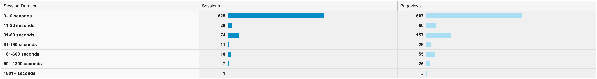
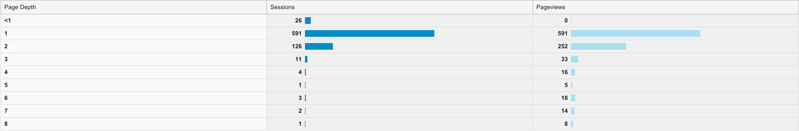
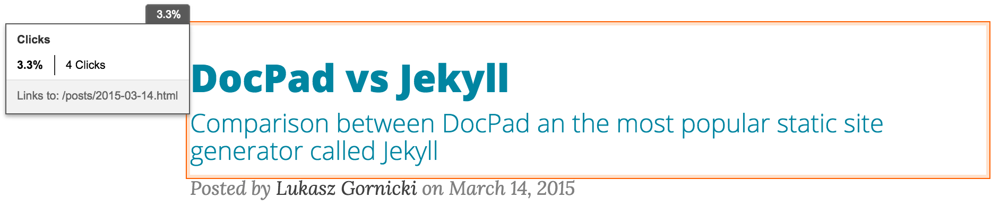
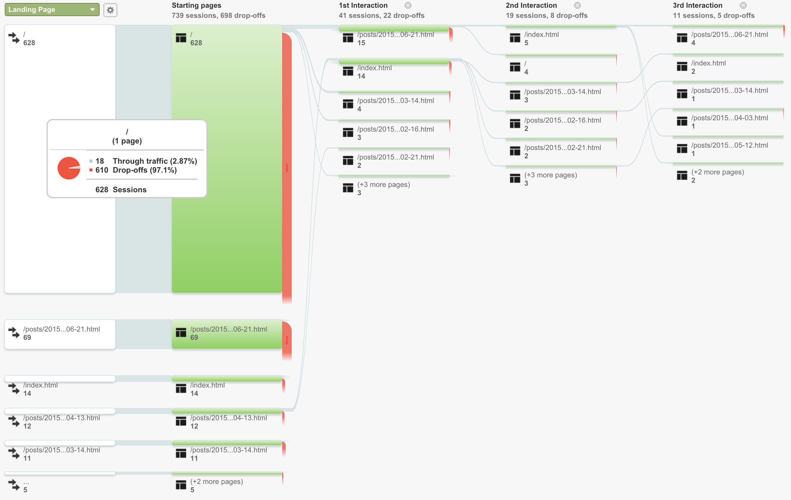
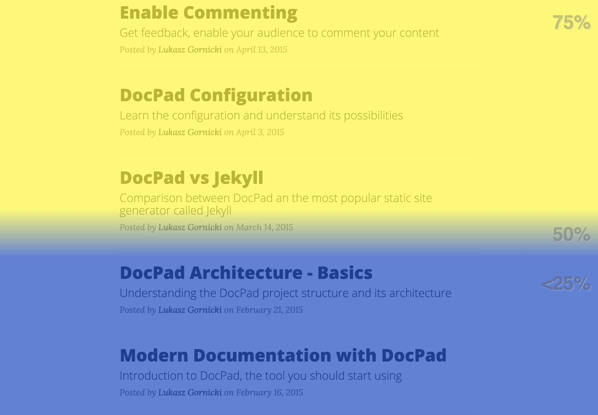

Over a month ago I've enabled Google Analytics and Inspectlet on this blog and explained how to do it in post  [Get Some Data! part 1](2015-05-12.html). I did it for two reasons, I wanted to explain how to use custom environment settings in DocPad and wanted to check out Inspectlet. In general, I regret that I waited 3 months to enable analytics on my blog. I really do. I've lost so much interesting data.

## Google Analytics

This cow is huge, and brings a lot of milk. I'll just mention few the most interesting statistics here and share my opinion.

### Main Statistical Data - Audience

Of course the most important data are where you learn that you had 765 individuals reading your blog. But then it is kind of embarrassing to learn that the average time they've spent on it was 26 seconds......not much time to read a post. This data is very useful but requires investigation. If most of the people get to my blog from google search, this is pretty clear that after reading a first paragraph they just quit as the page they received did not contain information they were looking for. This is pretty normal behavior, you get result and you open several pages one by one and quickly asses if page has content for you or not. Anyway it requires a further investigation for sure and a comparison with a long running readers sessions.

#### Details

So once I know I had 765 readers, I want to know what browsers they use and once they use mobile, which screen resolution is the most common. Why? Web is complicated with all those different browsers and devices, it is hard to make your page compatible with all of them. So you need to pick always the most popular once to deliver the best experience to the majority of your audience. Simple as that. And you need to take care for mobile readers obviously.

So it was interesting for me to learn that almost 90% of my readers are a Chrome users and 80% of them use Macs...and they do not use Safari browser? I wonder why :)
And it is interesting to know how hard it is to support mobile and try to support majority....as there is no majority. In case of my blog I have 50/50 rate for iOS and Android users with all possible screen resolutions. Mobile is hard.

For Mobile there are of course more details data available. I can even identify what devices they use to read my blog - 50% of my readers use iPhone.

#### New vs Returning

This is also very interesting data from a documentation point of view. Good to know how many new visitors you have and how many of them return to your page.

54 people regularly visit my blog again. I like it, it is super cool feeling to know that people want to read and visit you more often. The average time they've spent on the blog is not 26 but 1,08sec. This means they are interested. This is also very important for documentation portal to learn how many regular users you have, how that number change over time and if it increases or rather decreases. If you have a portal with technical content that must be visited by your users, the number of regular users should increase over time so you see it is gaining popularity.

#### Engagement

There are two types of data:
* Session Duration: It is a comparison of session length, sessions amount and a page views. For example, I've learned that sessions, when a reader took a look on two different pages on my blog, took between 31-60 seconds. Anyway, a picture can tell you more here:
  

  
* Page Depth: It is just a different view of the same data:
  

### Acquisition

In this section of Google Analytics you get an overview on how your readers got to your page. I've learned that only half of my readers got to my page directly, and rest through social media or other channels.

#### Social Network Referrals

This one is probably interesting for bloggers. I personally love it. Cool to see that 10% of people that visited my blog learned about it on social media. On the other hand it is interesting that it is only 10%. It means that the rest has to come from other locations like google search for example.

So people visit me thanks to mentions in Twitter, Facebook, Disqus comments on different blogs and also LinkedIn.

It might be an interesting statistic but not very useful for documentation sites. "Cool people share us with others on social media, but I can't use it much to improve my documentation page".

#### Referral Traffic

It may be compared to previous data. So it is a list of sites that readers visited to end up in your page. Again, that is a kind of cool info only. But it is nice to know that I gained few more readers thanks to the fact that I was mentioned in the ETC blog: http://etc-conference.eu/news/new-approach-creating-software-documentation-non-wiki-and-non-dita

### Behavior

So basically how readers behave on my blog.

#### Content Drilldown

You can have a details data on page view per each section of your documentation site. You can see how many users read `tutorials` section and then drill down to see which tutorial is the most popular. That is very useful.

#### Exit Pages

It is an overview that shows how many users exit your blog from a specific page. 85% of my readers exit from my main page which is not good. I know I have to rework it and have to advertise specific posts more. Also, it doesn't necessarily mean that there is something wrong with my landing page, maybe it is clear enough for a reader to identify quickly that he is in a wrong place.
Useful data that needs to be analyzed.

#### In-Page Analytics

Very cool stuff. You can open and see the analytics directly on page itself. You see where your readers click:

and get a full overview of statistics for specific page:

Thanks to it I've learned that 55% of readers of my last blog clicked my name link to see details about me, and apparently I left a blank link and forgot to point it to a specific place. Now it is fixed. Imagine how many issues you can fix with this part of analytics.

### Flows

This is one of my favorites. You can have here a nice view on your users flow. How they navigate to get to their destination? Which path they had to take to get there? Is there a page that had a huge number of views, but a reader had to go through more then 3 different pages to get there?

You have different flows, like **User Flow**, **Social User Flow** or **Behavior Flow** shown below.

After analyzing the flow you can have a good view on how you need to improve you navigation.

## Inspectlet

Unfortunately the free account I use allows to record 4 individual user sessions a day. The tool gives two things that you can't get at Google Analytics:
* Full recording of user session
* Heatmaps:
  * eye-tracking heatmap
  * click heatmap
  * scroll heatmap

### Recording

You can actually see in action how user interacts with your page. Sample of one of my recordings http://www.inspectlet.com/dashboard/watchsession/1668565138/3686093353?pn=1&accessResourceKey=01d2f5132d752a0345bd5e6716013b76f1c9bfe8

This is pretty useful at the final stage of your data analysis. First you start with huge statistical data from Google Analytics, then you narrow down to individual users to get more specific answers. And in general it is cool to see how the user reads your whole article :)

### Heatmaps

The most popular one is the eye-tracking heatmap. In this case it is not a camera that is obviously used for tracking, but the mouse movement. As you probably noticed, most of the time when you read from a screen, you tend to move your mouse into the same direction. So you get your page with additional layer of points where your user looked at. If more users looked at the same spot, the heat point gets more intensive and bigger. This is a eye-tracking heatmap from my main page created out of 36 individual visits:

Additional two heatmap data are the click and scroll, which means that you have a map of user clicks and info about how far users scrolled on your page. This is a scroll heatmap from my main page created out of 36 individual visits:

Heatmaps are extremely useful but for that you need a lot of data, a lot of individual visits. With free account from Inspectlet it is not possible as it tracks only 4 users per day. For over a month, for my main page, I received data with only 36 individual visits although I know I had over 700 visits in total.

These are the improvements you could implement after analyzing heatmap data:
* Restructure position and behavior of your navigation
* Place the most important information in front of user's eyes
* Eliminate parts that are not spotted
* From the scroll heatmap learn which documents suck in length and content. It is hard to make a clear statement like: `scroll` documents are wrong. Sometimes even long documents gets full attention, it also depends on the content - I noticed it on analyzing scroll heatmap on my post about DocPad and Jekyll comparison. So if you spot a document that is super long, but the scroll heatmap reveals that it had full reader attention, then analyze the doc, its style and structure and port it to other documents.

There is probably much more learning possible.

## Final Conclusion

Having Google Analytics or any other analytics tool is not all. You get a lot of data that you need to understand it and it is really not easy. I will just bullet point few important things you need to assure before you start analyzing data:

* **Exclude data noise**: Set it up in the way that your own team and other teams that do not use your solution as customers, are not tracked and do not make a noise in your statistics. They do not behave as real users.
* **Gather some data first**: Give it few months to live. Get some data and then work on it. 1k page views is a minimum for a big documentation portal, on only for initial analysis without big decisions to change something in UI.
* **What is your target**: To analyze data, first you need to know what are the assumptions, who are you targeting with your Web page. Do you actually expect only newbies to enter and don't expect them to come back. Is it normall for you that they should only open specific page and not drill down for more content. Do you expect to have a regular visitors that should read every new article otherwise it means they are not using your solution? You need this answers. Me myself I'm still not able to answer all these questions in regards to my blog. So good luck :)

### Which Tool

You need both tools. You just start analyzing huge statistical data from Google Analytics and then just narrow down to more specific investigation with data from Inspectlet. Google Analytics is free but Inspectlet not. So you either get a budget for a license or get a talented Web developer to embed [heatmap.js](http://www.patrick-wied.at/static/heatmapjs/) library directly in your UI.
